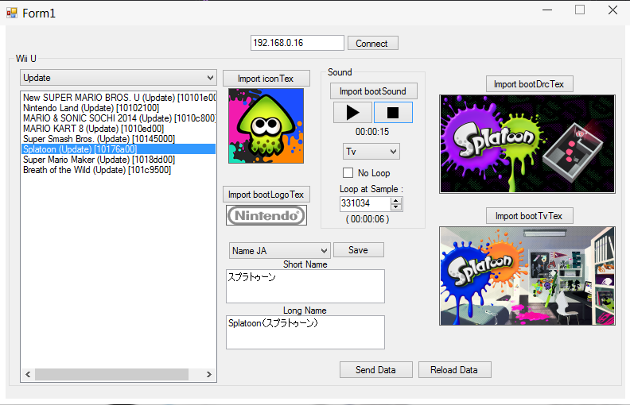

# Wii U Title Boot Editor

A tool to edit your Wii U titles' meta folder.

### Usage

1. Go to the Homebrew launcher and run Ftpiiu Everywhere (can be downloaded here : https://github.com/FIX94/ftpiiu/releases).
2. Run the App.
3. Enter your Wii U's IP and click on "Connect".
4. Select a title and edit whatever you want.
5. Click on "Send Data".
6. Done !

### Features

- TGA Boot Image Editing + Signature
- Full btsnd/wave support

### More

You can watch a Demo here : https://youtu.be/Rj0oGL5LC8w

If you have any question, please contact me on discord : random#4657
